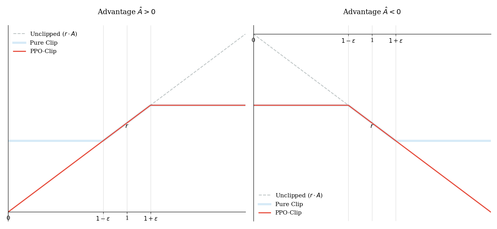

# PG+TRPO+PPO

## 目录
- [1.1 策略梯度 (Policy Gradient, PG)](#11-策略梯度-policy-gradient-pg)
- [1.2 信任区域方法 (Trust Region Methods)](#12-信任区域方法-trust-region-methods)
    - [TRPO 引入的两个核心组件](#trpo-引入的两个核心组件)
        - [1. 重要性采样 (Importance Sampling)](#1-重要性采样-importance-sampling)
        - [2. KL 散度 (KL Divergence)](#2-kl-散度-kl-divergence)
- [PPO](#ppo)
    - [PPO-CLIP](#ppo-clip)
    - [PPO 完整算法](#ppo-完整算法)
        - [1. Total Loss](#1-total-loss)
        - [2. 优势函数计算 (Advantage Estimation)](#2-优势函数计算-advantage-estimation)
        - [3. PPO 算法完整流程](#3-ppo-算法完整流程)
- [详细推导](#详细推导)
    - [重要采样](#重要采样)
    - [GAE](#gae)
- [参考资料](#参考资料)

---

在前文中我们详细介绍了优势函数的计算，可是优势函数只是一个具体的数值，其可以看作为我们具体策略的一个权重。
在正式介绍PPO之前，我们先介绍一下之前的策略优化算法以及其局限性。

## 1.1 策略梯度 (Policy Gradient, PG)

策略梯度的核心思想非常朴素：如果一个动作表现好（优势函数为正），就增加它的出现概率；反之则降低。
其目标函数通常表示为：

$$
J(\theta) = \hat{\mathbb{E}}_t[ \log \pi_{\theta}(a_t|s_t) \hat{A}_t ]
$$

其梯度表示为：

$$
\nabla_{\theta} J(\theta) = \hat{\mathbb{E}}_t\left[\nabla_{\theta}\log \pi_{\theta}(a_t \mid s_t)\,\hat{A}_t\right]
$$


**PPO虽然简单，但是存在下面几个问题**：

1. **样本利用率极低**：从公式可以看出，它是一个 On-policy 的算法（是基于当前的策略优化的），每条样本只能用一次，用完就丢（后面介绍的重要性采样可以解决这个问题）
2. **训练极其不稳定，方差大**：从下面展开的公式可以看出来，如果智能体偶然尝试了一个概率极低（比如 0.001）的动作，并且这个动作恰好得到了一个还不错的奖励。那么此时梯度放大的倍数将极大。

$$
\nabla_{\theta} J(\theta) = \hat{\mathbb{E}_t} \left[ \underbrace{\frac{1}{\pi_{\theta}(a_t \mid s_t)}} \cdot \underbrace{\nabla_{\theta} \pi_{\theta}(a_t \mid s_t)} \cdot \hat{A}_t \right]
$$


## 1.2 信任区域方法 (Trust Region Methods) 

为了解决 PG 的不稳定问题，后续工作提出了以 **TRPO** 为代表的信任区域方法。其核心思路是：**在更新策略时，限制新旧策略之间的差异，确保更新在一定区间内进行。**

其数学表达式为:

$$
\max_{\theta } \hat{\mathbb{E}}_t \left[ \frac{\pi_\theta(a_t | s_t)}{\pi_{\theta_{\text{old}}}(a_t | s_t)} \hat{A}_t \right] 
$$

$$
\text{subject to } \hat{\mathbb{E}}_t[\text{KL}[\pi_{\theta_{\text{old}}}(\cdot | s_t), \pi_\theta(\cdot | s_t)]] \leq \delta. 
$$

其中， $\theta_{\text{old}}$ 是更新前的策略参数。在对目标进行线性近似、对约束进行二次近似之后，可以使用共轭梯度算法高效地近似求解该问题（求解很复杂，这里就不详细介绍，后续算法也与此无关，了解即可）。

实际上建议使用惩罚项而非约束，即求解如下的无约束优化问题：

$$
\max_{\theta } \hat{\mathbb{E}}_t \left[ \frac{\pi_\theta(a_t | s_t)}{\pi_{\theta_{\text{old}}}(a_t | s_t)} \hat{A}_t - \beta \text{KL}[\pi_{\theta_{\text{old}}}(\cdot | s_t), \pi_\theta(\cdot | s_t)] \right] 
$$

### TRPO 引入的两个核心组件


#### 1. 重要性采样 (Importance Sampling)
* 它是一种统计学技巧，允许我们通过从分布 $q$ （旧策略）中采样的样本，来估计分布 $p$ （当前策略）下的期望。其核心数学形式为([详细推导见](#重要采样))：

$$
\mathbb{E}_{x \sim p}[f(x)] = \mathbb{E}_{x \sim q}\left[ \frac{p(x)}{q(x)} f(x) \right]
$$

可以观察到，这里将基于 $p$  的概率分布的期望转换为基于 $q$ 的概率分布的期望
等价于 ( $\pi_{\theta}(a_t,s_t)$ ) $->$  ( $\pi_{\theta _{old}}(a_t,s_t)$ ),这样我们就可以用老的样本来更新我们的策略了！

**举个例子：LLM 场景下的直观理解**

在 LLM 的训练中，重要性采样实际上解决了“一边生成一边学习”效率太低的问题。我们可以这样理解这个过程：

1. **采样阶段 (Rollout)**：
   我们先让“旧模型” ( $\pi_{\text{old}}$ ) 去推理生成一段文本（例如回答一个问题）。在这个过程中，我们要记录下旧模型生成每一个 Token 的**概率**。

2. **评估阶段 (Evaluation)**：
   现在我们要优化“新模型” ( $\pi_{\theta}$ )。我们不需要让新模型重新去生成文本，而是让它去看刚才旧模型生成的**那串 Token 序列**，并计算：如果让新模型来写，它在每一个位置写出那个相同 Token 的**概率**是多少。

3. **计算比值 (Ratio)**：
   我们将 **新模型概率 / 旧模型概率** 得到一个比值 $r_t(\theta)$ ：
   * 如果 $r_t(\theta) > 1$ ：说明新模型比旧模型更倾向于说出这个 Token。
   * 如果 $r_t(\theta) < 1$ ：说明新模型在这一点上变得更保守了。

4. **形成损失**：
   我们将这个比值乘以该 Token 对应的**优势函数 $\hat{A}_t$**（即这个词说得好不好的得分）。


它解决了 **On-policy 效率低**的问题。
* 在原生 PG 中，必须用最新策略 $\pi_\theta$ 采样。

* 引入重要性采样后，我们可以使用旧策略 $\pi_{\theta_{\text{old}}}$ 采集的数据（即 Ratio $r_t(\theta) = \frac{\pi_\theta}{\pi_{\theta_{\text{old}}}}$），这使得数据可以被重复利用（Off-policy 风格，但仍是一个 on-policy 算法）。

---
#### **2. KL 散度 (KL Divergence)**
* 它衡量两个概率分布之间“距离”的非对称指标。

    $$\text{KL}(P || Q) = \sum P(x) \log \frac{P(x)}{Q(x)}$$

在上文的TRPO中，我们减去一个 $\text{KL}[\pi_{\theta_{\text{old}}}(\cdot | s_t), \pi_\theta(\cdot | s_t)]$ 也就是让我们每一次更新和就旧策略偏离不要太远，限制更新幅度不要太大。


虽然TRPO解决了PG算法一些问题，但仍然存在下面几个问题：
1. 二阶导数(**最致命的问题**) : TRPO 为了精确控制 KL 散度，需要计算目标函数的二阶导数,海森矩阵的大小是参数量 $N$ 的平方 ($N \times N$) 计算量巨大。
2. 实现难度极高：相比于只需要几行代码就能实现的 Adam 优化器或 PPO，TRPO 的实现逻辑非常复杂，涉及 Fisher 信息矩阵的近似计算、线搜索（Line Search）等。

## PPO 

好的，接下来就开始我们的PPO算法的介绍，首先是一种PPO最重要的思想 **PPO-CLIP**：

### PPO-CLIP

- 当 $A_t(s_t, a_t) > 0$ 时，说明我们当前执行的动作 $a_t$ 相较于别的动作更好，因此我们要提升 $\pi_{\theta}(a_t|s_t)$。但是考虑到在采样不足的情况下，$\pi_{\theta}$ 和 $\pi_{\theta_{old}}$ 的分布差异不能太大，因此 $\frac{\pi_{\theta}(a_t|s_t)}{\pi_{\theta_{old}}(a_t|s_t)}$ 是有上限的，即不能一味轻信 $A_{\phi}^{GAE}(s_t, a_t)$ 而持续不断提升 $\pi_{\theta}(a_t|s_t)$，你要保证 $\pi_{\theta}$ 在 $\pi_{\theta_{old}}$ 的信任阈内。我们假设当这个比值 $>= 1 + \epsilon$ 的时候，就对这个比值做 clip，固定在 $1 + \epsilon$。
- 当 $A_t(s_t, a_t) < 0$ 时，说明我们当前执行的动作 $a_t$ 相较于别的动作更差，因此我们要降低 $\pi_{\theta}(a_t|s_t)$。考虑到 $\pi_{\theta}$ 和 $\pi_{\theta_{old}}$ 的分布差异不能太大，因此 $\frac{\pi_{\theta}(a_t|s_t)}{\pi_{\theta_{old}}(a_t|s_t)}$ 是有下限的，即不能一味轻信 $A_{\phi}^{GAE}(s_t, a_t)$ 而持续不断降低 $\pi_{\theta}(a_t|s_t)$，我们假设当这个比值 $<= 1 - \epsilon$ 的时候，就对这个比值做 clip，固定在 $1 - \epsilon$。
-  其中 $\epsilon$  是PPO当中的一个超参。

经此思想，提出以下 PPO-CLIP 机制，公式如下:

$$
L^{CLIP}(\theta) = \hat{\mathbb{E}}_t \left[ \min(r_t(\theta)\hat{A}_t, \text{clip}(r_t(\theta), 1 - \epsilon, 1 + \epsilon)\hat{A}_t) \right]
$$


但是这个时候不禁有一个疑惑：**如果 clip 是用于控制动作概率变化幅度的，那为什么还需要 $min$ ？
比如说按照下界进行 clip ，结果取完 $min$ 操作保留的却还是未 clip 的值？**

其实主要的原因是因为clip后，某些token的损失变成了一个常数（梯度消失）导致不能正常更新了，我们去min就是为了减少一些没有必要的clip。

以下是详细的介绍：

* **$A > 0$，要提升动作概率**
    * $r_t(\theta) \ge 1 + \epsilon$，说明当前动作概率已经很大了，不需要再过度提升了（可能会崩），所以选择 clip 后的标量值（对应取 $\min$ 操作）参与计算目标函数值，**此时 actor model 不会被更新**（因为此时的待优化变量被 clip 成一个常数，梯度为0，也就是说把这个变量从目标函数中移除了）。
    * $r_t(\theta) < 1 + \epsilon$，当前动作概率没那么大，可以正常对动作概率计算梯度，以进行更新（变大）（如果直接CLIP的话，其梯度会消失，更新不了）。
* **$A < 0$，要降低动作概率**
    * $r_t(\theta) \le 1 - \epsilon$，说明当前动作概率很小，不需要再降低了（可能会崩），所以选择 clip 后的标量值（对应取 $\min$ 操作）参与计算目标函数值，**此时 actor model 不会被更新**（原因同上）。
    * $r_t(\theta) > 1 - \epsilon$，当前动作概率没那么小，可以正常对动作概率计算梯度，以进行更新（变小）。



### PPO 完整算法

有了核心的 **PPO-CLIP** 裁剪策略后，在实际应用（特别是像 LLM 这样的复杂场景）中，我们需要构建一个完整的 Actor-Critic 框架来训练。这意味着我们不仅要更新策略网络（Actor），还要同时更新价值网络（Critic），并鼓励模型探索。

### 1. Total Loss

在 PPO 实现中（如 GPT 的训练），通常采用 **Actor** 和 **Critic** 共享部分参数的架构。因此，我们的最终损失函数需要包含三部分：

1.  **策略损失 (Policy Loss)**：即我们前面推导的 $L^{CLIP}$，用于让模型生成更好的动作。
2.  **价值损失 (Value Loss)**： $L^{VF}$，让 Critic 网络更准确地预测当前状态的价值 $V(s)$。这通常是一个均方误差（MSE）。
3.  **熵奖励 (Entropy Bonus)**： $S$，鼓励策略保持一定的随机性（Entropy），防止模型过早收敛到局部最优（即防止它太“自信”地只输出某一种结果）。

**最终的优化目标**（最大化）如下：

``` math
L_t^{CLIP+VF+S}(\theta) = \hat{\mathbb{E}}_t \left[ \underbrace{L_t^{CLIP}(\theta)}_{\text{让策略更好}} - c_1 \underbrace{L_t^{VF}(\theta)}_{\text{让评分更准}} + c_2 \underbrace{S[\pi_\theta](s_t)}_{\text{鼓励探索}} \right]
```

**参数说明：**
* $c_1, c_2$：平衡各项权重的超参数。
* **$S$：熵奖励项（Entropy Bonus）**
    *   **公式**： $S[{\pi}_{\theta}](s_t) = - \sum_{a} \pi_{\theta}(a|s_t) \log \pi_{\theta}(a|s_t)$ 。
    *   **作用**：衡量策略分布的“混乱程度”或“随机性”。熵越大，分布越平坦（每个动作概率差不多）；熵越小，分布越尖锐（确定性地选某几个动作）。
    *   **目的**：鼓励探索（Exploration）。在训练初期，防止模型过早地“迷信”某个局部最优动作（Collapse to deterministic policy），强迫它多尝试其他可能性。
* **$L_t^{VF}$：价值函数损失（Value Function Loss）**
    *   **公式**： $L_t^{VF} = (V_\theta(s_t) - V_t^{target})^2$（均方误差 MSE）。
    *   **作用**：训练 Critic 网络（价值网络），使其能够准确预测当前状态 $s_t$ 的真实价值。
    *   **目标值:  $V_t^{target}$**：通常使用真实的回报 $G_t$ 或者更稳定的估计值 $V(s_t) + \hat{A}_t$ 来作为监督信号。

---

### 2. 优势函数计算 (Advantage Estimation)

在第一章我们了解到了一些RL的基本概念，比如 $V$、 $Q$ 和 $A$ 这几个函数，接下来我们来介绍如何将其运用到真实的RL训练中去。

我们现在有三个函数定义，如下：
* **状态价值 $V(s_t)$**：当前状态 $s$ 下，未来收益的期望。
* **动作价值 $Q(s_t, a_t)$**：在 $s$ 采取 $a$ 后，未来收益的期望。
* **优势函数 $A(s_t, a_t)$**： $A(s_t, a_t) = Q(s_t, a_t) - V(s_t)$。

在实际训练中，我们一般用一个共享参数模型去估计状态价值，但无法知道的 $Q$ 值，但可以根据前一章介绍的贝尔曼方程去估计它。

如下：
$Q(s_t, a_t)$ 可以近似为 $r_t + \gamma V(s_{t+1})$。

那么优势函数可以写成：

$$\delta_t = r_t + \gamma V(s_{t+1}) - V(s_t)$$

这就是 **TD (Temporal Difference) 方法**。

*   **优点**：**无偏 (Unbiased)**。它只看眼下的一步，非常稳定（方差小）。
*   **缺点**：**高方差 (High Variance)**。他只看眼前的一步，所以如果 $V$ 估得不准，它就错得离谱（偏差大）。

---

既然 TD 只看一步太“短视”，那我们能不能看远一点，直接看到底？
这就是我们的 **MC (Monte Carlo) 方法**。

我们可以一直等到游戏结束，把后面所有的奖励加起来，作为 $Q(s_t, a_t)$ 的无偏估计。

$$ Q(s_t, a_t) \approx G_t = r_t + \gamma r_{t+1} + \gamma^2 r_{t+2} + \dots + \gamma^{T-t} r_T $$

此时优势函数为：

$$ A_t^{MC} = G_t - V(s_t) $$

*   **优点**：**无偏 (Unbiased)**。因为是真实发生的累计奖励，只要采样够多，均值一定是对的。
*   **缺点**：**高方差 (High Variance)**。每一步环境的随机性都会累积。如果一局游戏很长，每次的结果可能天差地别，导致训练极不稳定。

---


有没有一种方法，既能像 TD 那样方差小，又能像 MC 那样偏差小？
答案是：**折中**。

这就是PPO采用的 GAE (Generalized Advantage Estimation) 估计。


我们可以不只看 1 步，也不看无穷步，而是看 n 步：
*   1步 (TD): $r_t + \gamma V_{t+1}$
*   2步: $r_t + \gamma r_{t+1} + \gamma^2 V_{t+2}$
*   ...


它引入一个超参数 $\lambda \in [0, 1]$，把从 1 步到 $\infty$ 步的所有估计值，按指数衰减的权重加在一起。

公式最终简化为（具体推导见[GAE 公式推导](#GAE)）：

$$\hat{A}_t^{GAE} = \delta_t + (\gamma \lambda) \delta_{t+1} + (\gamma \lambda)^2 \delta_{t+2} + \dots = \sum_{l=0}^{\infty} (\gamma \lambda)^l \delta_{t+l}$$

其中 $\delta_t = r_t + \gamma V(s_{t+1}) - V(s_t)$ 就是我们最开始提到的 TD 误差。

*   当 $\lambda=0$ 时，就是 TD。
*   当 $\lambda=1$ 时，就是 MC。
*   通常取 $\lambda=0.95$，在方差和偏差之间取得最佳平衡。

---

如果你已经写好了计算 $V$ 的网络，过渡到 GAE 只需要一个循环：

1.  **计算所有时刻的 $\delta_t$**：用你的 $V$ 网络跑出每个状态的值，结合 Reward 计算出 $\delta_t = r_t + \gamma V_{t+1} - V_t$。
2.  **逆向累积**：从最后一个时间步往前推，利用公式 $A_t = \delta_t + (\gamma \lambda) A_{t+1}$。

---

### 3. PPO 算法完整流程 

最后，我们将所有组件串联起来。这是一个标准的 **Actor-Critic 风格** 的 PPO 训练循环：

$$
\begin{aligned}
&\textbf{Algorithm 1 } \text{PPO, Actor-Critic Style} \\
&\text{--------------------------------------------------------------------------------------------} \\
&1: \mathbf{for} \text{ iteration } = 1, 2, \dots \mathbf{do} \\
&2: \quad \mathbf{for} \text{ actor } = 1, 2, \dots, N \mathbf{do} \\
&3: \quad \quad \text{Run policy } \pi_{\theta_{\text{old}}} \text{ in environment for } T \text{ timesteps} \\
&4: \quad \quad \text{Compute advantage estimates } \hat{A}_1, \dots, \hat{A}_T \\
&5: \quad \mathbf{end \ for} \\
&6: \quad \text{Optimize surrogate } L \text{ wrt } \theta, \text{ with } K \text{ epochs and minibatch size } M \le NT \\
&7: \quad \theta_{\text{old}} \leftarrow \theta \\
&8: \mathbf{end \ for} \\
&\text{--------------------------------------------------------------------------------------------}
\end{aligned}
$$


## 详细推导

### 重要采样

**推导过程**

**展开期望定义**：将期望写成积分形式：

   $$
   \mathbb{E}_{x \sim p}[f(x)] = \int p(x) f(x) \, dx
   $$

**引入参考分布 $q$**：在被积函数中同时乘以并除以 $q(x)$（前提是在 $p(x)f(x) \neq 0$ 的区域内 $q(x) > 0$）：

   $$
   \mathbb{E}_{x \sim p}[f(x)] = \int \frac{q(x)}{q(x)} p(x) f(x) \, dx
   $$

**替换新的概率函数**：将 $q(x)$ 提出来作为新的概率测度（积分基准），剩下的部分看作新的被积函数：

   $$
   \mathbb{E}_{x \sim p}[f(x)] = \int q(x) \left[ \frac{p(x)}{q(x)} f(x) \right] \, dx
   $$

**转换回期望形式**：根据期望定义，我们得到最终形式：

   $$
   \mathbb{E}_{x \sim p}[f(x)] = \mathbb{E}_{x \sim q}\left[ \frac{p(x)}{q(x)} f(x) \right]
   $$

---

### GAE

我们定义 $k$ 步回报（$k$-step return）下的优势函数估计为 $\hat{A}_t^{(k)}$。

**1. k-step 优势函数定义**

*   **1-step (TD)**: 

$$ \hat{A}_t^{(1)} = \delta_t = -V(s_t) + r_t + \gamma V(s_{t+1}) $$

根据前一章推导的贝尔曼方程 $V(s_{t+1})=r_{t+1}+\gamma V(s_{t+2})$ 得到：

*   **2-step**: 
    
$$ \hat{A}_t^{(2)} = -V(s_t) + r_t + \gamma r_{t+1} + \gamma^2 V(s_{t+2}) $$
    
利用 $\delta_{t+1} = -V(s_{t+1}) + r_{t+1} + \gamma V(s_{t+2})$，我们可以将 $V(s_{t+2})$ 替换掉，得到：

$$ \hat{A}_t^{(2)} = \delta_t + \gamma \delta_{t+1} $$

*   **3-step**: 

$$ \hat{A}_t^{(3)} = \delta_t + \gamma \delta_{t+1} + \gamma^2 \delta_{t+2} $$

*   ...
*   **k-step**: 
    
$$ \hat{A}_t^{(k)} = \sum_{l=0}^{k-1} \gamma^l \delta_{t+l} = -V(s_t) + r_t + \gamma r_{t+1} + \dots + \gamma^{k-1} r_{t+k-1} + \gamma^k V(s_{t+k}) $$

---

**2. GAE 的加权求和**

GAE 定义为上述 $k$ 步估计的**指数加权移动平均**。权重为 $(1-\lambda)\lambda^{k-1}$。

$$
\begin{aligned}
\hat{A}_t^{GAE(\gamma, \lambda)} &= (1-\lambda) \left( \hat{A}_t^{(1)} + \lambda \hat{A}_t^{(2)} + \lambda^2 \hat{A}_t^{(3)} + \dots \right) \\
&= (1-\lambda) \left( \delta_t + \lambda(\delta_t + \gamma\delta_{t+1}) + \lambda^2(\delta_t + \gamma\delta_{t+1} + \gamma^2\delta_{t+2}) + \dots \right)
\end{aligned}
$$

---
**3. 合并同类项 (推导核心)**

我们要统计每一个 $\delta_{t+l}$ 前面的系数。

对于 $\delta_{t+l}$，它出现在如下所有后续项中：
$$\hat{A}_t^{(l+1)}, \hat{A}_t^{(l+2)}, \dots$$

因此，$\delta_{t+l}$ 的总系数为：
$$
\text{Coeff}(\delta_{t+l}) = (1-\lambda) \gamma^l (\lambda^l + \lambda^{l+1} + \lambda^{l+2} + \dots)
$$

提取公因式 $\lambda^l$：

$$
\text{Coeff}(\delta_{t+l}) = (1-\lambda) \gamma^l \lambda^l (1 + \lambda + \lambda^2 + \dots)
$$

利用几何级数求和公式 $\sum_{i=0}^\infty \lambda^i = \frac{1}{1-\lambda}$：

$$
\text{Coeff}(\delta_{t+l}) = (1-\lambda) (\gamma \lambda)^l \frac{1}{1-\lambda} = (\gamma \lambda)^l
$$

---

**4. 最终形式**

将系数代回，得证：

$$
\hat{A}_t^{GAE(\gamma, \lambda)} = \sum_{l=0}^{\infty} (\gamma \lambda)^l \delta_{t+l} = \delta_t + (\gamma \lambda)\delta_{t+1} + (\gamma \lambda)^2\delta_{t+2} + \dots
$$

这也就是我们在代码中常用的递归计算形式：

$$ \hat{A}_t = \delta_t + (\gamma \lambda) \hat{A}_{t+1} $$


--- 

## 参考资料
- [如何理解 PPO-CLIP 目标函数中的 clip 和 min 操作？过犹不及论](https://zhuanlan.zhihu.com/p/28223597805)